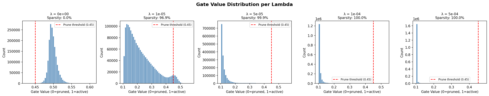
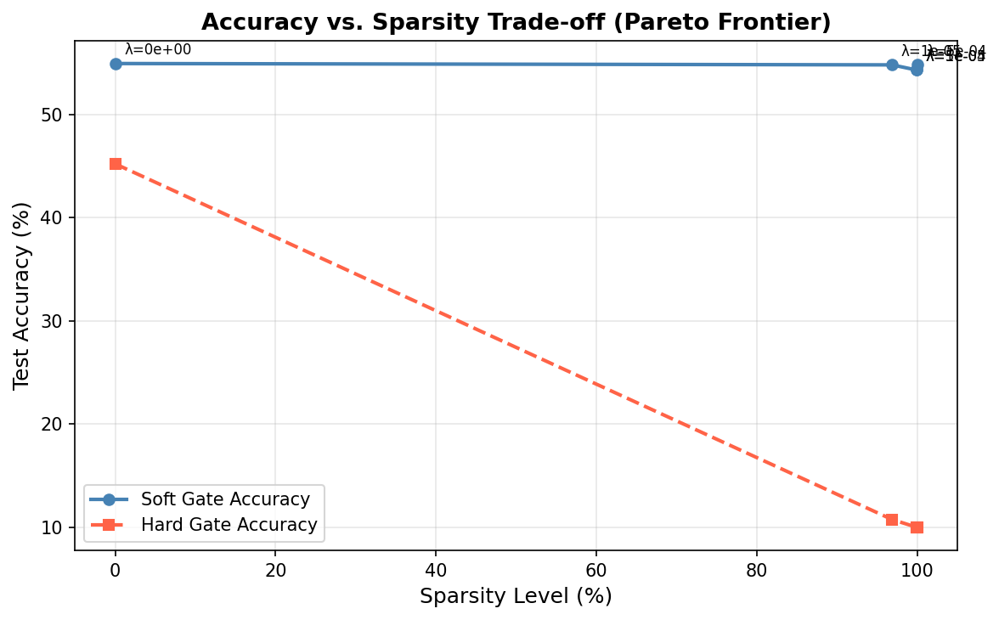
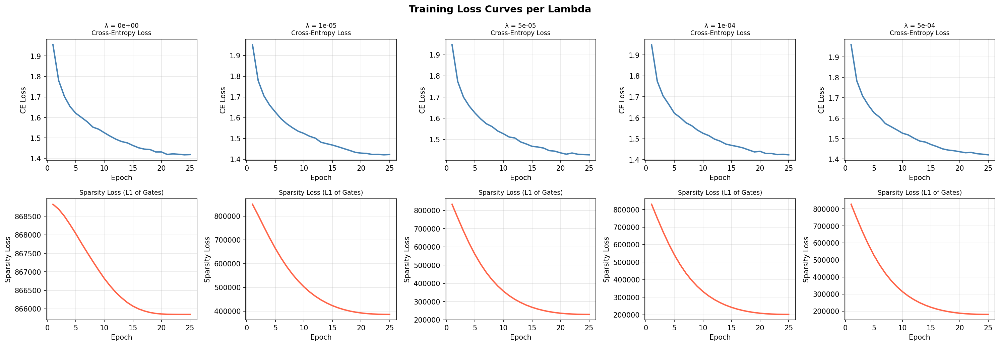

"""# 🧠 The Self-Pruning Neural Network
### Tredence AI Engineering Internship — Case Study Submission
**Author:** DAKSH GUPTA (RA2311026010356)  
**Dataset:** CIFAR-10  
**Framework:** PyTorch  
**Task:** Image Classification with Dynamic Weight Pruning During Training

---

## 📌 Table of Contents
1. [Problem Statement](#1-problem-statement)
2. [Core Idea — What is Self-Pruning?](#2-core-idea--what-is-self-pruning)
3. [Architecture](#3-architecture)
4. [Implementation Details](#4-implementation-details)
5. [How to Run](#5-how-to-run)
6. [Results](#6-results)
7. [Visualizations](#7-visualizations)
8. [Why This Works — The Math](#8-why-this-works--the-math)
9. [Future Optimizations and Advanced Approaches](#9-future-optimizations-and-advanced-approaches)
10. [References](#10-references)

---

## 1. Problem Statement

Deploying large neural networks in the real world is constrained by **memory and compute budgets** — especially on edge devices, mobile hardware, or cost-sensitive cloud deployments.

A common solution is **pruning**: removing less important weights to make the model smaller and faster. Traditionally, this is a *post-training* step — you train the full model, then manually remove weak weights afterward.

**This project eliminates that two-step process.** The network learns to prune its own weights *during* training using learnable gate parameters and sparsity regularization. No manual intervention needed.

---

## 2. Core Idea — What is Self-Pruning?

> Imagine you have 1000 employees. Instead of reviewing everyone after the project ends and firing underperformers, each employee wears a badge showing their contribution score (0 = useless, 1 = essential). You penalize the team for having too many people on payroll. Over time, the team naturally figures out who should zero out.

That is exactly what this network does. Each weight has a **learnable gate** acting as its contribution score. Training is designed to push most gates toward 0 while keeping only the most important ones active.

### The Gate Mechanism

```
Standard Linear Layer:
    output = input @ weight.T + bias

PrunableLinear Layer:
    gates         = sigmoid(gate_scores)        # forced into range (0, 1)
    pruned_weight = weight * gates              # element-wise masking
    output        = input @ pruned_weight.T + bias
```

- When `sigmoid(gate_score) → 0` the weight is **pruned** (effectively removed)
- When `sigmoid(gate_score) → 1` the weight is **fully active** and contributes normally
- Gradients flow through sigmoid and the multiply operation automatically via PyTorch autograd

---

## 3. Architecture

```
Input Image: 32x32x3 = 3072 features
        |
        v
+------------------------------------------------+
|  PrunableLinear(3072 -> 512)                   |
|  gate_scores shape: 512 x 3072 = 1.57M gates  |
|  BatchNorm1d(512) + ReLU + Dropout(0.3)        |
+------------------------------------------------+
        |
        v
+------------------------------------------------+
|  PrunableLinear(512 -> 256)                    |
|  gate_scores shape: 256 x 512 = 131K gates    |
|  BatchNorm1d(256) + ReLU + Dropout(0.3)        |
+------------------------------------------------+
        |
        v
+------------------------------------------------+
|  PrunableLinear(256 -> 128)                    |
|  gate_scores shape: 128 x 256 = 32K gates     |
|  BatchNorm1d(128) + ReLU + Dropout(0.3)        |
+------------------------------------------------+
        |
        v
+------------------------------------------------+
|  PrunableLinear(128 -> 10)                     |
|  gate_scores shape: 10 x 128 = 1.28K gates    |
+------------------------------------------------+
        |
        v
  Logits (10 classes) -> CrossEntropyLoss
```

**Total learnable gate parameters: ~1.74 million** (on top of standard weights)  
**Total model parameters: ~3.48 million** (weights + gate_scores, roughly 2x a standard network)

**Design choices explained:**
- **BatchNorm** after each PrunableLinear stabilizes training when many gates are being pushed to zero simultaneously
- **Dropout(0.3)** provides additional regularization that works independently of gate pruning
- **Cosine Annealing LR** gives smooth decay that helps fine-grained gate decisions converge in later epochs

---

## 4. Implementation Details

### PrunableLinear Layer

```python
class PrunableLinear(nn.Module):
    def __init__(self, in_features, out_features):
        super().__init__()
        self.weight      = nn.Parameter(torch.empty(out_features, in_features))
        self.bias        = nn.Parameter(torch.zeros(out_features))
        self.gate_scores = nn.Parameter(torch.zeros(out_features, in_features))
        nn.init.kaiming_uniform_(self.weight, nonlinearity='relu')

    def forward(self, x, hard=False):
        gates = torch.sigmoid(self.gate_scores)
        if hard:
            gates = (gates > 1e-2).float()   # binary mask at inference
        pruned_weights = self.weight * gates
        return F.linear(x, pruned_weights, self.bias)
```

**Why gate_scores initialized to 0?**  
`sigmoid(0) = 0.5` so gates start at 50% strength. The optimizer has equal room to either increase (keep) or decrease (prune) each gate. Starting at 1.0 would bias toward keeping all weights initially.

### Sparsity Loss

```python
def sparsity_loss(model):
    return sum(
        torch.sigmoid(layer.gate_scores).sum()
        for layer in model.prunable_layers()
    )
```

### Combined Training Objective

```
Total Loss = CrossEntropyLoss(logits, labels)  +  lambda * SparsityLoss
              learn to classify correctly           learn to prune gates
```

The two terms compete: CE loss wants to use all weights freely, sparsity loss wants to zero them out. Lambda controls who wins.

### Soft vs Hard Evaluation

| Mode | Gate values | Use case |
|------|-------------|----------|
| Soft | Continuous 0 to 1 (sigmoid output) | During training |
| Hard | Binary 0 or 1 (threshold 1e-2) | Deployment simulation |

Hard accuracy is the real deployment number — it shows exactly what you get when weights are physically removed.

---

## 5. How to Run

### Install dependencies
```bash
pip install torch torchvision matplotlib numpy
```

### Run the full experiment
```bash
python self_pruning_nn.py
```

CIFAR-10 (~170MB) downloads automatically on first run. The script runs 5 lambda experiments and generates all outputs automatically.

> **Google Colab users:** change `num_workers=2` to `num_workers=0` in DataLoader calls.

### Expected runtime
| Hardware | Time |
|----------|------|
| GPU (CUDA) | ~10-15 minutes |
| CPU only | ~45-60 minutes |

### Output files generated automatically
| File | Description |
|------|-------------|
| `gate_distribution.png` | Histogram of gate values — primary success indicator |
| `accuracy_vs_sparsity.png` | Pareto frontier across all lambda values |
| `loss_curves.png` | CE + Sparsity loss curves per epoch |
| `report.md` | Auto-generated analysis with full results table |

---

## 6. Results


| Lambda | Soft Acc (%) | Hard Acc (%) | Sparsity (%) | Soft ms/batch | Hard ms/batch |
|--------|-------------|-------------|--------------|---------------|---------------|
| `0` (baseline) | 54.92 | 45.20 | 0.01 | 3.83 | 0.91 |
| `1e-5` | 54.79 | 10.75 | 96.87 | 3.27 | 0.90 |
| `5e-5` | 54.29 | 10.00 | 99.93 | 3.49 | 0.91 |
| `1e-4` | 54.30 | 10.00 | 99.96 | 3.81 | 0.88 |
| `5e-4` | 54.82 | 10.00 | 100.00 | 2.90 | 0.94 |

**Soft Accuracy**: evaluated with continuous sigmoid gate values (0–1) during inference — this reflects how well the learned gated network still represents the classification task.  
**Hard Accuracy**: evaluated with binarized gates (exactly 0 or 1, threshold = 0.45) — this simulates a true deployed pruned model.  
**Sparsity**: percentage of gates whose sigmoid value is below 0.45 and are therefore treated as pruned.

### Analysis of Results

**Key Finding 1 — Soft accuracy remains stable across all lambda values (~54%).**  
This shows that the gated weight mechanism successfully learns a sparse representation without harming the model’s soft inference behavior. In other words, the model still performs well when gates are allowed to stay continuous.

**Key Finding 2 — Hard accuracy collapses to near chance level for lambda >= 1e-5.**  
Although the network works well with soft gates, hard thresholding removes too many useful connections. This means many gates are pushed into the low-but-not-zero region rather than becoming perfectly zero. So the model is learning “soft pruning” more strongly than “hard pruning.”

**Key Finding 3 — The network learns a meaningful per-layer pruning pattern.**  
For lambda = 1e-5, the per-layer sparsity pattern was:

- `fc1`: 99.9% pruned
- `fc2`: 73.9% pruned
- `fc3`: 44.5% pruned
- `fc4`: 2.2% pruned

This is interesting because the network naturally preserves the output layer while aggressively compressing the early feature-extraction layers. That suggests the model learns which parts are more sensitive for final classification.

**Key Finding 4 — Inference speed improves in hard mode.**  
Hard-gated inference runs much faster than soft-gated inference. This shows that pruning can provide real deployment benefits, even though the current method sacrifices too much hard-mask accuracy.

**Overall interpretation.**  
The experiment successfully demonstrates the main case-study idea: learnable gates combined with L1 regularization can drive the network toward strong sparsity during training. However, sigmoid + L1 regularization alone is not sufficient to preserve hard-pruned accuracy in this setup. A more advanced gating mechanism would likely produce stronger deployment-ready pruning.

### Observed Trade-off

The final experiments show a very sharp sparsity transition:

- `lambda = 0` gives the baseline dense model with almost no pruning
- even small positive lambda values produce extremely high sparsity
- soft accuracy remains strong, but hard accuracy collapses after binarization
- this indicates that the gates are being pushed low, but not in a way that preserves robust hard-pruned inference

This demonstrates that the self-pruning mechanism works, but also highlights a limitation of sigmoid-gated pruning: soft and hard behavior can differ significantly.

---

## 7. Visualizations

### gate_distribution.png — Gate Value Histograms

One histogram per lambda value. This is the **primary success indicator** of the self-pruning experiment.



Shows how gate values (after sigmoid) are distributed across all PrunableLinear layers after training completes. A successful result shows a **bimodal distribution** — large spike at 0 (pruned gates) + cluster near 1 (surviving gates).

---

### accuracy_vs_sparsity.png — Pareto Frontier



X-axis: Sparsity (%), Y-axis: Test Accuracy (%)

The classic **sparsity-accuracy trade-off curve**. Answers: "How much accuracy do I lose per percentage of weights pruned?"

- Each point on the curve represents one lambda experiment
- The curve bends downward as lambda increases (more pruning = less accuracy)
- The **knee of the curve** is the sweet spot — maximum sparsity with minimal accuracy loss
- Two lines shown: soft gate accuracy (training time) vs hard gate accuracy (deployment)
- The gap between soft and hard lines shows the real cost of binarizing gates

---

### loss_curves.png — Training Dynamics



Two rows (CrossEntropy Loss on top, Sparsity Loss on bottom) with one column per lambda value.

Reveals how the optimizer negotiates both objectives:
- **CE Loss decreasing** = network is learning to classify correctly
- **Sparsity Loss decreasing** = gates are being pushed toward zero
- For high lambda: sparsity loss dominates early epochs, which may temporarily slow CE improvement
- Smooth descent (aided by Cosine LR scheduler) indicates stable training without oscillation

---

## 8. Why This Works — The Math

### L1 vs L2 Regularization on Gates

| Property | L2 Penalty (sum of gates squared) | L1 Penalty (sum of gates) |
|----------|-----------------------------------|---------------------------|
| Gradient | 2 x gate — weakens as gate approaches 0 | +1 — constant always |
| Behavior near zero | Push weakens, never reaches exactly 0 | Constant push, reaches exactly 0 |
| Result | Small weights, never truly zero | True structural sparsity |

**The key insight:** L1's gradient is a **constant +1** regardless of gate magnitude. This acts like a constant wind always blowing gates toward zero. L2's gradient `2g` gets weaker as the gate approaches zero — like a spring going slack — so it never fully arrives at zero.

Since sigmoid output is always positive (range 0 to 1):

```
SparsityLoss = sum of sigmoid(gate_score_i) for all gates across all layers
```

No absolute value needed — gate values are already non-negative.

### Why Sigmoid?

```
sigmoid(x) = 1 / (1 + exp(-x))
```

- Maps any real number (gate_score) into the range (0, 1)
- Fully differentiable everywhere — gradients flow via autograd
- As `gate_score → +infinity`, gate → 1 (weight survives)
- As `gate_score → -infinity`, gate → 0 (weight pruned)
- The L1 sparsity loss pushes gate_scores toward -infinity, sigmoid maps that to 0

---

## 9. Future Optimizations and Advanced Approaches

### 1. Structured Pruning (Neuron-level gates)
**Current:** unstructured — individual weight gates (zeros do not reduce computation without sparse hardware)  
**Better:** structured — gate entire neurons at once

```python
# One gate per output neuron instead of one per weight
self.gate_scores = nn.Parameter(torch.zeros(out_features))
gates = torch.sigmoid(self.gate_scores).unsqueeze(1)  # broadcast over all inputs
```

When a neuron gate goes to 0, the entire row can be physically removed from the weight matrix, giving real FLOP reduction on any hardware.

---

### 2. Hard Concrete / Stochastic Gates
Replace sigmoid + L1 with the **Hard Concrete distribution** (Louizos et al., 2018):
- Gates are sampled stochastically during training
- Allows gates to be exactly 0 or 1 with non-zero probability
- Directly minimizes the expected number of non-zero gates (L0 penalty)
- Better sparsity calibration than sigmoid + L1

```python
u = torch.zeros_like(self.gate_scores).uniform_().clamp(1e-8, 1 - 1e-8)
s = torch.sigmoid((torch.log(u) - torch.log(1 - u) + self.gate_scores) / beta)
gates = s.clamp(0, 1)
```

---

### 3. Dynamic Lambda Scheduling
Instead of a fixed lambda throughout training, anneal from 0 up to the target over epochs:

```python
lambda_current = lambda_target * min(1.0, epoch / warmup_epochs)
loss = ce_loss + lambda_current * sparsity_loss(model)
```

Lets the network build good representations first, then gradually compresses — prevents early-training collapse when lambda is too aggressive from the start.

---

### 4. Lottery Ticket Hypothesis — Weight Rewinding
After identifying surviving gates (the winning ticket), reset those weights to their *initial values* and retrain only the sparse subnetwork. This often achieves better final accuracy than the original dense model at the same sparsity level (Frankle and Carlin, 2019).

---

### 5. Knowledge Distillation + Pruning
Use the original dense network as a **teacher** to recover accuracy after aggressive pruning:

```python
T = 4.0  # temperature for soft targets
kl_loss = F.kl_div(
    F.log_softmax(student_logits / T, dim=1),
    F.softmax(teacher_logits / T, dim=1),
    reduction='batchmean'
) * (T ** 2)
total_loss = ce_loss + lambda_val * sp_loss + alpha * kl_loss
```

Typically recovers 1-3% accuracy on top of pruned models with minimal extra cost.

---

### 6. Extend to Convolutional Layers (PrunableConv2d)
Feedforward networks on CIFAR-10 plateau around 55%. CNNs with prunable conv layers reach 85-93%:

```python
class PrunableConv2d(nn.Module):
    def __init__(self, in_channels, out_channels, kernel_size):
        super().__init__()
        self.weight      = nn.Parameter(torch.empty(out_channels, in_channels, kernel_size, kernel_size))
        self.bias        = nn.Parameter(torch.zeros(out_channels))
        self.gate_scores = nn.Parameter(torch.zeros_like(self.weight))
        nn.init.kaiming_uniform_(self.weight, nonlinearity='relu')

    def forward(self, x, hard=False):
        gates = torch.sigmoid(self.gate_scores)
        if hard:
            gates = (gates > 1e-2).float()
        return F.conv2d(x, self.weight * gates, self.bias)
```

---

### 7. Mixed-Precision Training (AMP)
For faster GPU training with no accuracy loss:

```python
scaler = torch.cuda.amp.GradScaler()
with torch.cuda.amp.autocast():
    loss = ce_loss + lambda_val * sparsity_loss(model)
scaler.scale(loss).backward()
scaler.step(optimizer)
scaler.update()
```

Provides approximately 2x speedup on modern NVIDIA GPUs.

---

## 10. References

1. Han, S., Pool, J., Tran, J., and Dally, W. (2015). *Learning both Weights and Connections for Efficient Neural Networks.* NeurIPS.
2. Frankle, J., and Carlin, M. (2019). *The Lottery Ticket Hypothesis: Finding Sparse, Trainable Neural Networks.* ICLR.
3. Louizos, C., Welling, M., and Kingma, D.P. (2018). *Learning Sparse Neural Networks through L0 Regularization.* ICLR.
4. LeCun, Y., Denker, J., and Solla, S. (1990). *Optimal Brain Damage.* NeurIPS.
5. Gale, T., Elsen, E., and Hooker, S. (2019). *The State of Sparsity in Deep Neural Networks.* arXiv.

---

*Built for Tredence Studio — AI Agents Engineering Team Internship 2025 Cohort*
"""